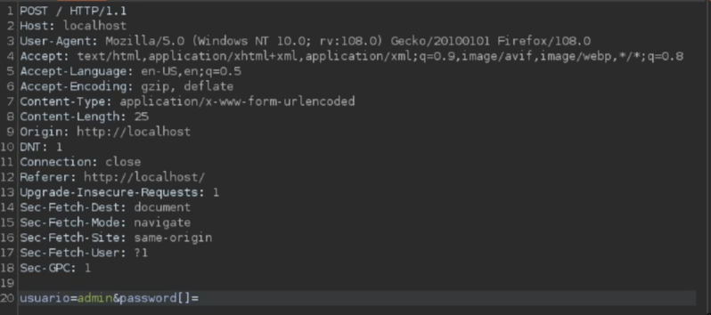

_Type juggling_ = cuando el lenguaje (PHP) convierte automáticamente el tipo de una variable según el contexto (comparación, suma, etc.), sin que el programador lo pida.

Un panel de login es vulnerable a _TypeJuggling_ cuando el usuario tiene una contrasena cuyo _hash md5_ empiece por 0e.... y la validacion se hace con == en lugar de =\=\=, entonces vos insertas una contrasena cuyo _hash md5_ tambien comience por 0e, ya que hace una comparacion matematica, y 0e131231231 seria 0^nro = 0 en ambos casos, por lo que es exitoso

```php
<?php
$stored_hash = "0e123456789";  
$input_hash  = $_POST['pass'];

if ($stored_hash == $input_hash) {
    echo "Login OK";
}
?>
```
Esto hoy en dia es casi imposible de encontrar, porque tenes que saber un usuario cuya contrasena hasheada empiece por 0e, la comparativa se tiene que hacer con == y ademas las contrasenas se tienen que guardar en md5 en la db, cosa que no existe.


Tambien puede ser vulnerable a un _TypeConfusion_ cuando se hace la comparativa con **strcmp** tal que asi:
```php
$real_user = "admin";
$real_pass = "secret123";

$user = $_POST['user'];
$pass = $_POST['password'];

if (
    strcmp($user, $real_user) === 0 &&
    !strcmp($pass, $real_pass)
) {
    echo "Login OK";
} else {
    echo "Login incorrecto";
}
```


y haciendo la siguiente peticion, cambiando el tipo de dato a _array_, poniendo corchetes en la contrasena de la siguiente forma:


